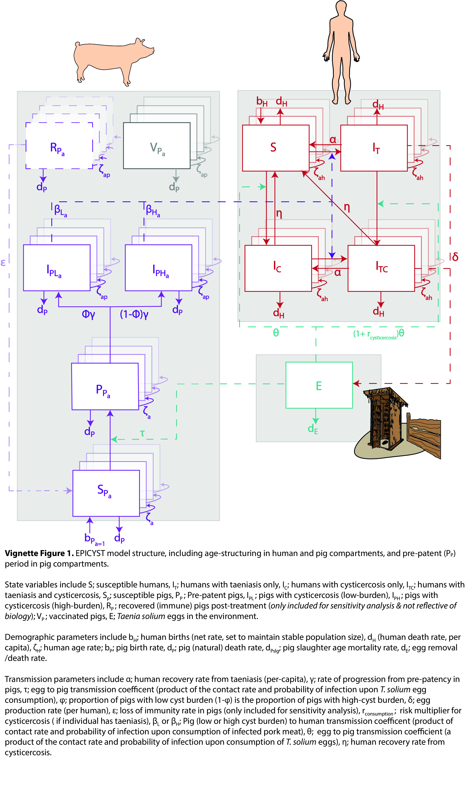
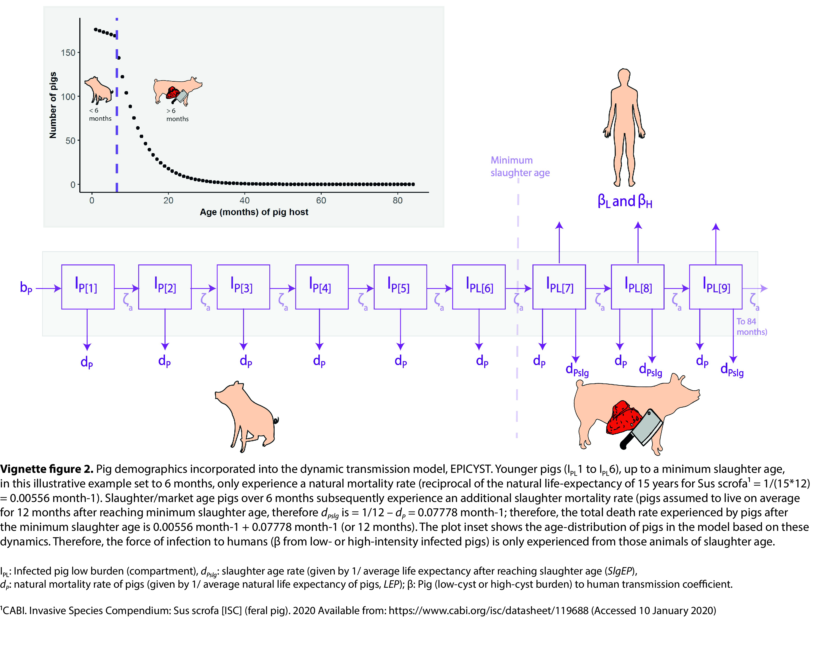
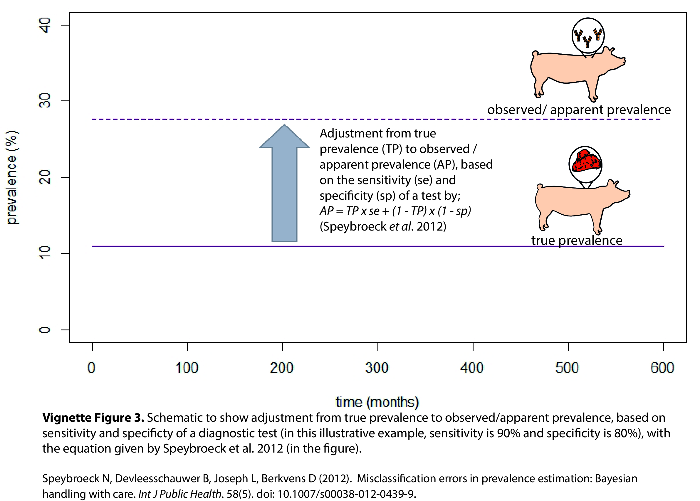

```{r, echo=FALSE}
library(epicyst)
```

# Call default parameters and equilibrium solutions

The `set_up()` function provides the user a means to specify parameters and starting conditions for a model run. Input parameters, as well as starting prevalence for Taeniasis, and Cysticercosis (in the porcine and human populations) may be left at the default values or specified in the function call. 

Changes to default prevalence values will initiate to re-estimation of transmission parameters to allow the system to run at the newly specified endemic equilibrium. The `set_up()` function returns a list of two elements: 1) The input parameters for a model run (standardised time units and dependent parameters included) and 2) Initial state variable values.

To initiate and view default parameters:

```{r}
initialise <- set_up()
```

```{r}
# View parameters
initialise[[1]][1:6]
# View state variable starting values (susceptible humans and pigs)
initialise[[2]][2]
initialise[[2]][5]
```

Input arguments for `set_up()` are documented in the help file `?set_up()`. Certain combinations of input prevalence may not be possible to fit, in which case an error message will be thrown.

## Age-structured model inputs for human and pig demographics

In the age-structured model, human and pig compartments are stratified into age groups. For pigs, there are 150 age groups (one month per group) in the default model, which can be viewed (and modified) through the following `set_up(number_age_classes_pig = 150)` for the number of pig age classes, and `set_up(pig_age_class_width = 1)` for the width (in months) of these age group.

For humans in the default model, there are 7 age groups, representing 0 - 4.99, 5 - 9.99, 10 - 14.99, 15 - 29.99, 30 - 49.99, 50 - 69.99 and 70 - 89.99 years. These age groups are structured to include school-age children (5 - 9.99 & 10 - 14.99 yrs). While there is an input to change these `set_up(number_age_classes_human = 7)`, leaving this default model for human age-structuring is recommended. 

Figure 1 below provides a representation of the age-structure in the model, including demographic and transmission parameters. 

```{r echo=FALSE, out.width='100%'}

```

## Other key input parameters in the age-structured pig model

Input parameters into `set_up()` specify additional age-specific features in the pig age-structured model. Firstly, the `set_up(slaughter_age_min = 6)` input
specifies the minimum age (in months) in which pigs are slaughtered, which is set to 6 months in the default model. Secondly, the `set_up(slgEP = 1)` specifies the number of years pigs are expected live, on average, after reaching slaughter age (a default for the average natural life expectancy for pigs is also specified by `set_up(LEP = 10)`). 

Figure 2 below highlights how pig demographics have been incorporated into the age-structured EPICYST, which simyulates pigs before the minimum slaughter age experiencing a constant natural mortality rate (dP; the reciprocal of the natural life expectancy parameter, `LEP`), and pigs after reaching the minimum slaughter age experiencing an additional mortality rate associated with reduced survival due to slaughter (dPslg; the reciprocal of the average life expectancy after reaching slaughter age, `slgEP`). Equally, humans are only exposed to infected pork from slaughter age animals. 

```{r echo=FALSE, out.width='100%'}

```
Other modifiable parameter inputs, impacting baseline demographic parameters in `set_up()`, human population size `HPS`, pig population size `PPS`, human life expectancy (in years) `LEH`, and the rate of pork meal procurement in humans `chi`.  

EPICYST can also be parameterised for specific epidemiological conditions by specifying epidemiological parameters in `set_up()`, including Egg to pig transmission coefficient `tau_input`, Egg to pig transmission coefficient `theta_input`, Pig to human transmission coefficient `beta_input`, and the proportion of pigs with low-cyst burden `phi`.

# Run the age-structured model with no interventions

The `run_model()` function provides all functionality for model runs. To run the model at baseline, with default parameters and endemic equilibrium values, only the length of the model run (specified in years) need be specified:

```{r}
m1 <- run_model(time = 50)
```

```{r, results='asis', echo=FALSE}
knitr::kable(utils::head(m1[, c(1:2,5:11)], 10), caption = 'Egg compartment & susceptible humans (all 7 age groups)', digits = 1)
knitr::kable(utils::head(m1[, c(1,33:34,183:184, 333:334, 483:484)], 10), caption = 'Susceptible pigs, pre-patent pigs, infected (low or high burden) pigs; with just the first two age groups (months 0-1, 1-2) shown', digits = 1)
knitr::kable(utils::tail(m1[, c(1, 936:940)], 10), caption = 'Tracked prevalence with (stable) human and pig population totals', digits = 2)
```

It is suggested that a period of burn in (specified in years) is included to ensure small changes in endemic equilibrium at the start of a run are avoided:

```{r}
m2 <- run_model(time = 50, burn_in = 100)
```

Model output starts after this burn in period.

The model can be run with different starting parameters or endemic prevalences. For example to run the model with an prevalence of Taeniasis of 4%:

```{r}
# Set up the model, specifying the new Taeniasis prevalence
s1 <- set_up(TPrev = 0.04)
# Run the model, with new input parameters and initial conditions
m3 <- run_model(time = 50, burn_in = 100, params = s1[[1]], initial_states = s1[[2]])
```

Model runs return a `data.frame` of model output for each time step. The model output data.frame facilitates visualisation using general base `R` or other plotting methods (eg `ggplot2`).

```{r, fig.align='center',fig.width=7, fig.height=5}
# Plot the output in base R
plot(m3$Pig_Cysticercosis_prev*100 ~ m3$t, type="l", col="darkmagenta", ylim=c(0,20), ylab = 'prevalence (%)', xlab = 'time (months)')
lines(m3$Human_Cysticercosis_prev*100 ~ m3$t, type="l", col="deeppink")
lines(m3$Human_Taeniasis_prev*100 ~ m3$t, type="l", col="dodgerblue")
legend('topright', c('porcine cysticercosis', 'human cysticercosis', 'human taeniasis'), lty = c(1, 1, 1),
       col=c('darkmagenta', 'deeppink', 'dodgerblue'))
```


## Diagnostic adjustment to adjust true modelled prevalence to observed modelled prevalence

The user can also specify diagnostic parameters in `set_up()` to adjust modelled prevalence to observed/apparent prevalence by providing the sensitvity and specificity characteristics of a particular diagnostic test. This will allow the user to plot both the true modelled prevalence, and adjusted observed/apparent prevalence, as described in Figure 3 below

```{r echo=FALSE, out.width='100%'}

```

To run this in the model, this can be specified as (e.g. with a hypothetical 90% sensitivity and 80% specificty of a porcine cysticercosis diagnostic test) :

```{r}
# Set up the model, specifying diagnostic parameters for pig cysticerosis prevalence adjustment
 s1 <- set_up(PC_sens=0.9, PC_spec=0.8)
# Run the model, with new input parameters and initial conditions
 m4 <- run_model(time = 50, burn_in = 100, params = s1[[1]], initial_states = s1[[2]])
```

## Specifying the non age-structured model

The age-structured model can be configured to remove age-structuring, and therefore provide the original model presented in Winskill et al. 2017. To specify the non age-structured model, the following parameter inputs need to be included in `set_up()`. :

```{r}
# Set up the model, specifying the non age-structured model
 s1 <- set_up( number_age_classes_human = 1, number_age_classes_pig = 1, slaughter_age_min = 0)
# Run the model, with new input parameters and initial conditions
 m5 <- run_model(time = 50, burn_in = 100, params = s1[[1]], initial_states = s1[[2]])
```
This will collapse age groups so that only one age group is modelled for human and pig state variables:

```{r, results='asis', echo=FALSE}
knitr::kable(utils::head(m5[, c(1,5:14)], 10), caption = 'All state variables, collapsed to one age group', digits = 1)
```

If the user wishes to specify the complete original model presented in Winskill et al. 2017 with no age-strcuturing, and no pre-patent compartment in pigs (Pp compartments in Figure 1), then the user can set the rate at whicb pigs progress from the pre-patent compartment to a very high value (by setting the average duration pig remain in the pre-patent compartment parameter `psi`to a very small value i.e. 1 / 0.00000001) to effectively negate the use of this compartment as follows:

```{r}
# Set up the model, specifying the non age-structured model
 s1 <- set_up( number_age_classes_human = 1, number_age_classes_pig = 1, slaughter_age_min = 0,
               psi = 1/ 0.00000001)
# Run the model, with new input parameters and initial conditions
 m6 <- run_model(time = 50, burn_in = 100, params = s1[[1]], initial_states = s1[[2]])
```
```{r, fig.align='center',fig.width=7, fig.height=5}
# Plot the output in base R
plot(m6$Pig_Cysticercosis_prev*100 ~ m6$t, type="l", col="darkmagenta", ylim=c(0,30), ylab = 'prevalence (%)', xlab = 'time (months)')
lines(m6$Human_Cysticercosis_prev*100 ~ m6$t, type="l", col="deeppink")
lines(m6$Human_Taeniasis_prev*100 ~ m6$t, type="l", col="dodgerblue")
legend('topright', c('porcine cysticercosis', 'human cysticercosis', 'human taeniasis'), lty = c(1, 1, 1),
       col=c('darkmagenta', 'deeppink', 'dodgerblue'))
```

The user should note that the model has been updated to include a pre-patent period in pigs given that pigs are generally slaughtered within 6-36 months of age, and the pre-patent period (time from oncosphere/egg exposure to developing a mature larval-stage infection) is 2-3 months, so this is a non-negligble time period compared to the life-expectancy of the pig. Therefore, the pre-patent period should be included in the model. 

-----

Guidance for modelling interventions in age-structured EPICYST can be found in the next vignette: 
 