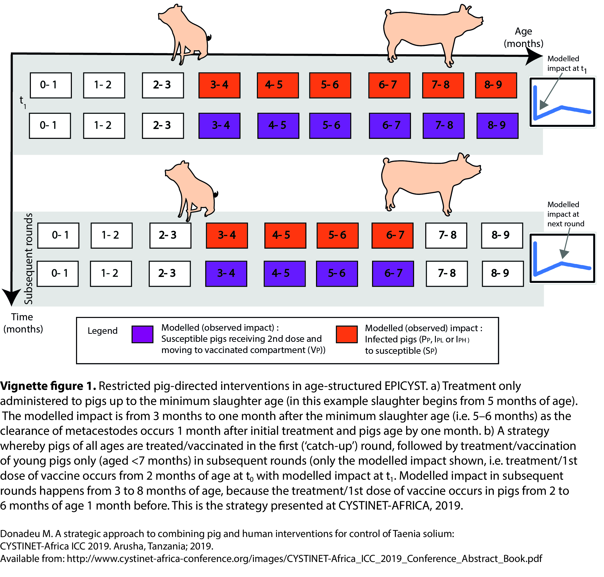

```{r, echo=FALSE}
library(epicyst)
```

-----

# Specifying multi-stage interventions

EPICYST can incorporate complex interventions, whereby different interventions and/or characteristics of interventions can be modified in a second stage. An example of a multi-stage intervention could be focussed on treating/vaccinating all pigs with a first intervention round, followed by treatment/vaccination in only young, susceptible pigs that enter the system in subsequent rounds (as proposed in CYSTINET-AFRICA, 2019) - Figure 1 below outlines such an intervention and how this works in EPICYST. 

```{r echo=FALSE, out.width='100%'}

```

A multi-stage intervention can be specified as follows: `intervention_frequency_stage1` and `intervention_frequency_stage2`; `intervention_time_stage1` and `intervention_time_stage2`; specifying the `num_intervention_rounds_stage1` and `num_intervention_rounds_stage1`, and specifying coverage and age-group targets for pig interventions (as outlined in Figure 1):

```{r}
# Run pig MDA
ci1 <- run_model(time = 11, burn_in = 100, intervention_stage1 = c('Pig_MDA','Pig_vaccine'), 
                intervention_stage2 = c('Pig_MDA','Pig_vaccine'),
                intervention_time_stage1 =1, intervention_frequency_stage1 = 3, 
                num_intervention_rounds_stage1 = 1, num_intervention_rounds_stage2 = 6, 
                intervention_time_stage2 =1.25, intervention_frequency_stage2 = 6, 
                pig_MDA_cov_stage1 = 0.9,  pig_MDA_cov_stage2 = 0.75, 
                pig_vaccine_ds1_cov_stage2 = 0.75, pig_vaccine_ds2_cov_stage2 = 0.75, 
                pig_vaccine_ds1_cov_stage1 = 0.9, pig_vaccine_ds2_cov_stage1 = 0.9, 
                age_target_pig_MDA_stage1 = c(4:150), age_target_pig_MDA_stage2 = c(4:7), 
                age_target_pig_vaccine_stage1 = c(4:150), age_target_pig_vaccine_stage2 = c(4:7))
```
```{r, fig.align='center',fig.width=7, fig.height=5}
# Plot the output in base R; pig MDA
plot(ci1$Pig_Cysticercosis_prev*100 ~ ci1$t, type = "l", col = "blue", ylim = c(0,15), 
     ylab = 'prevalence (%)', xlab = 'time (months)')
lines(ci1$Human_Cysticercosis_prev*100 ~ ci1$t, type = "l", col = "red")
lines(ci1$Human_Taeniasis_prev*100 ~ ci1$t, type = "l", col = "green")
legend('topright', c('Porcine cysticercosis','Human cysticercosis', 'Human taeniasis'), lty = c(1,1,1),
       col=c('blue','red','green'))
```

-----

# Further developments
Currently, EPICYST can only model pig interventions in multi-stage interventions simulations, and only two different stages can be specified.
Further development of EPICYST is planned to incorporate the ability to model additional stages, and to include complex/ multi-stage interventions for human directed interventions (human MDA with praziquantel or niclosamide, and human test & treat).

-----

# References
Donadeu M. A strategic approach to combining pig and human interventions for control of Taenia solium: CYSTINET-Africa ICC 2019. Arusha, Tanzania; 2019. Available from: http://www.cystinet-africa-conference.org/images/CYSTINET-Africa_ICC_2019_Conference_Abstract_Book.pdf