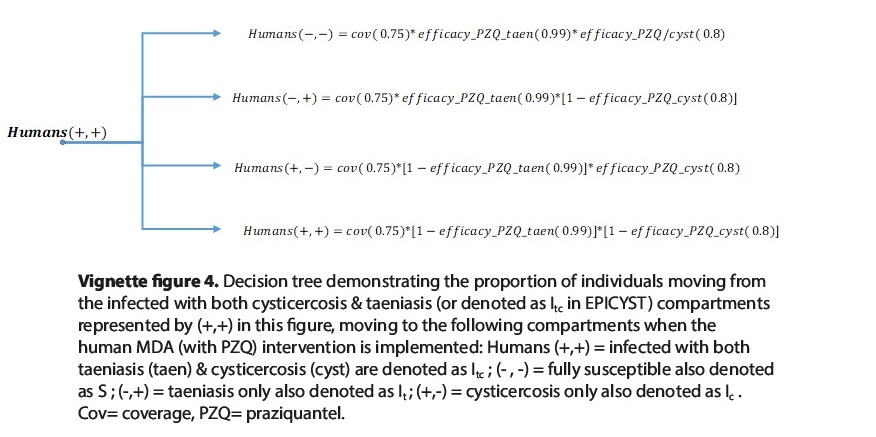

```{r, echo=FALSE}
library(epicyst)
```
# Call and view intervention effects

The intervention effect sizes can be viewed using the `intervention_effect_size()` function. Effect sizes can be modified if required:

```{r}
# initialise default intervention effect sizes
e1 <- intervention_effect_size()

```      
The user can review current effect sizes by calling `e1`

-----

# Run the model with intervention(s)

The model can be run with a number of interventions. These include:

1. Sanitation
2. Husbandry
3. Meat inspection
4. Human test and treat
5. Human mass drug administration with praziquantel or nicolsamide
6. Pig mass treatment / MDA
7. Pig vaccination

-----

# Modelling age-structured pig interventions

Age-structured EPICYST model can be used to implement age-stratified scheduling of both porcine mass treatment and vaccination. 

-----

## Pig mass treatment 

In the default model, porcine treatment with oxfendazole (OFZ) is given to pigs from two months of age (in Figure 1 below, this is from t0); therefore, the impact of treatment is assumed to occur from three months of age (i.e. age group 4) to account for the clearance of mature cysticerci, which takes approximately one month to occur (t1 in Figure 1 when infected pigs are moved back to the susceptible state).

```{r echo=FALSE, out.width='100%'}

```
To run this default pig mass treatment intervention, the following 

```{r}
# Run pig MDA
p1 <- run_model(time = 11, burn_in = 100, intervention ='Pig_MDA', 
                intervention_time = 1, intervention_frequency = 12)
```

Within `run_model`, parameters to specify the time at which interventions begin (in years) `intervention_time` and the frequency of occurrence in months e.g. the intervention to occur every 12 months `intervention_frequency` need to be included. Additional intervention parameters that may be called include specifying the coverage, using (with an example coverage of 70%) `pig_MDA_cov = 0.7` in `run_model`.

Model runs return a `data.frame` of model output for each time step. The model output data.frame facilitates visualisation using general base `R` or other plotting methods (eg `ggplot2`).

```{r, fig.align='center',fig.width=7, fig.height=5}
# Plot the output in base R; pig MDA
plot(p1$Pig_Cysticercosis_prev*100 ~ p1$t, type="l", col="blue", ylim=c(0,15), ylab = 'prevalence (%)', xlab = 'time (months)')
```

In addition, the number of intervention rounds can be specified with `num_intervention_rounds` in `run_model`, as follows:
```{r}
# Run pig MDA
p1a <- run_model(time = 11, burn_in = 100, intervention ='Pig_MDA', 
                intervention_time = 1, intervention_frequency = 12,
                num_intervention_rounds = 3)
```
```{r, fig.align='center',fig.width=7, fig.height=5}
# Plot the output in base R; pig MDA
plot(p1a$Pig_Cysticercosis_prev*100 ~ p1a$t, type="l", col="blue", ylim=c(0,15), ylab = 'prevalence (%)', xlab = 'time (months)')
```

The age-structuring in EPICYST enables more flexible interventions to be modelled, for example specifying that only young pigs are targeted for treatment (figure 2):

```{r echo=FALSE, out.width='100%'}
knitr::include_graphics('./Pig_MDA_fig2.jpg')
```

Specifying age-targeting for pig treatment can be achieved by calling the `age_target_pig_MDA = c()` in `run_model` as follows:

```{r}
# Run pig MDA
p2 <- run_model(time = 11, burn_in = 100, intervention ='Pig_MDA', 
                intervention_time = 1, intervention_frequency = 12, 
                age_target_pig_MDA = c(4:7))
```
```{r, fig.align='center',fig.width=7, fig.height=5}
# Plot the output in base R; pig MDA
plot(p2$Pig_Cysticercosis_prev*100 ~ p2$t, type="l", col="blue", ylim=c(0,15), ylab = 'prevalence (%)', xlab = 'time (months)')
```

-----

## Pig vaccination

As we have described for pig mass treatment, the default model age-targets pig vaccination with the following logic -  vaccination requires a 2-dose schedule using the TSOL18 vaccine with a 1-month gap between dose 1 and 2, and pigs can be vaccinated from 2 months of age (Figure 3 below). A 3-month overall frequency between rounds is also included as follows:

```{r echo=FALSE, out.width='100%'}

```
Running the default pig vaccination intervention can be achieved as follows: 
```{r}
# Run pig vaccine
p3 <- run_model(time = 11, burn_in = 100, intervention ='Pig_vaccine', 
                intervention_time = 1, intervention_frequency = 3)
```
```{r, fig.align='center',fig.width=7, fig.height=5}
# Plot the output in base R; pig vaccine
plot(p3$Pig_Cysticercosis_prev*100 ~ p3$t, type="l", col="blue", ylim=c(0,15), ylab = 'prevalence (%)', xlab = 'time (months)')
```

A coverage for dose 1 and dose 2 (for the 2-dose TSOL18 vaccination schedule) can therefore be specified, with `pig_vaccine_ds1_cov` and `pig_vaccine_ds2_cov` in `run_model`, along with age-targetting using `age_target_pig_MDA = c()` in `run_model`. The following example details dose 1 coverage of 70%, dose 2 coverage of 90%, and targetted age groups between 4 and 7 months (i.e. young pigs only):

```{r}
# Run pig vaccine
p4 <- run_model(time = 11, burn_in = 100, intervention ='Pig_vaccine', 
                intervention_time = 1, intervention_frequency = 3,
                pig_vaccine_ds1_cov = 0.7, pig_vaccine_ds2_cov = 0.9, 
                age_target_pig_vaccine = c(4:7))
```
```{r, fig.align='center',fig.width=7, fig.height=5}
# Plot the output in base R; pig vaccine
plot(p4$Pig_Cysticercosis_prev*100 ~ p4$t, type="l", col="blue", ylim=c(0,15), ylab = 'prevalence (%)', xlab = 'time (months)')
```

-----

## Human interventions (MDA and Test & Treat)

Mass drug administration (MDA) can be modelled using two different taenicides. Human MDA with praziquantel (PZQ) can be modelled, calling `Human_MDA_pzq` in `intervention` when using `run_model`, or human MDA with nicolsamide (NIC), calling `Human_MDA_nic`. These two taenicides are separately modelled, based on the following data and assumptions:

    NIC: The intervention works by targeting the adult tapeworm in taeniasis infections, and there is minimal absorption in the intestinal tract, meaning there is no effect on cysts and, therefore, cysticercosis (O’Neal et al., 2011). Following initialisation of the intervention, a certain proportion of individuals is moved from the human taeniasis infected (It) compartment to the susceptible compartment (S), and a certain proportion of humans infected with both taeniasis and cysticercosis move from the Itc compartment to the human cysticercosis-only infected compartment (Ic). Both proportions are defined by the efficacy of NCZ against taeniasis, reported to be 77.9% (Bustos et al., 2012) multiplied by the therapeutic coverage (the proportion of individuals in the population receiving treatment).

    PZQ: The human MDA with PZQ intervention is slightly more complex as PZQ targets both the adult tapeworm and cyst infections, so will have a therapeutic impact of both human taeniasis and human cysticercosis cases. Therefore, when the intervention is implemented, proportions of individuals are transferred from the infected with both taeniasis + cysticercosis (Itc) to the S, Ic, It compartments based on the proportions outlined in Figure 4 (summing to the total coverage proportion).

```{r echo=FALSE, out.width='100%'}

```

    In Figure 4, PZQ efficacy against taeniasis is set to a conservative 70%; however depending on the doseage used i.e. 40 mg/kg, 10 mg/kg or 5 mg/kg, efficacy could be modified in EPICYST (further functionality to be incorporated to enable this), in light of emerging evidence on efficacy/cure rates e.g. Haby et al. (2020). Literature on the efficacy of PZQ against both cerebral and dermal human cysticercosis in combination is very limited, with one meta-analysis showing that treatments including both PZQ and albendazole resulted in a 44% total resolution of all cystic lesions after computerised tomography (CT) or magnetic resonance imaging (MRI) scans in treated patients across six trials (Del Brutto et al., 2006). The efficacy was therefore set to a hypothetical 80%.

Human interventions can also be age-targetted, for example to simulate MDA in school-age children (SAC). The age-structuring within human compartments is such that the following age groups can be included or excluded: 0 - 4.99, 5 - 9.99, 10 - 14.99, 15 - 29.99, 30 - 49.99, 50 - 69.99 and 70 - 89.99 years, so for example if the user wishes to target MDA to SAC, then age groups 2 and 3 should be chosen. Figure 5 below provides a schematic to demonstrate how age-targetting works for MDA in EPICYST:

```{r echo=FALSE, out.width='100%'}
knitr::include_graphics('./Human_MDA_age.jpg')
```

The model with (or without) specified age-targetting for human MDA can therefore be called (for either human MDA with PZQ or NIC), with coverage (for PZQ as `human_MDApzq_cov` or for NIC as `human_MDAnic_cov`) as follows:

```{r}
# Run human MDA
h1 <- run_model(time = 11, burn_in = 50, intervention = 'Human_MDA_pzq', intervention_time = 1, 
                intervention_frequency = 6, human_MDApzq_cov = 0.75, age_target_human_MDA = c(2:7))
```
```{r, fig.align='center',fig.width=7, fig.height=5}
# Plot the output in base R
plot(h1$Pig_Cysticercosis_prev*100 ~ h1$t, type = "l", col = "blue", ylim = c(0,15), ylab = 'prevalence (%)', xlab = 'time (months)')
lines(h1$Human_Cysticercosis_prev*100 ~ h1$t, type = "l", col = "red")
lines(h1$Human_Taeniasis_prev*100 ~ h1$t, type = "l", col = "green")
legend('topright', c('Porcine cysticercosis','Human cysticercosis', 'Human taeniasis'), lty = c(1,1,1),
       col=c('blue','red','green'))
```

Human test & treat can also be modelled through specifying `Human_test_and_treat` in `intervention`, with `age_target_human_test_and_treat` and `human_testtreat_cov` in `run_model`.

-----

## Combined interventions

Interventions can be combined within the `intervention` argument in `run_model`, with the intervention parameter arguments as already described, for example:

```{r}
# Run combined interventions
hp1 <- run_model(time = 11, burn_in = 50, intervention =c('Pig_MDA','Pig_vaccine','Human_MDA_nic'), 
                intervention_time = 1, intervention_frequency = 3, 
                human_MDAnic_cov = 0.75, age_target_human_MDA = c(2:7),
                pig_MDA_cov = 0.945, age_target_pig_MDA = c(4:7),
                age_target_pig_vaccine = c(4:7),
                pig_vaccine_ds1_cov = 0.8, pig_vaccine_ds2_cov = 	0.7)
```
```{r, fig.align='center',fig.width=7, fig.height=5}
# Plot the output in base R; combined interventions
plot(hp1$Pig_Cysticercosis_prev*100 ~ hp1$t, type = "l", col = "blue", ylim = c(0,15), ylab = 'prevalence (%)', xlab = 'time (months)')
lines(hp1$Human_Cysticercosis_prev*100 ~ hp1$t, type = "l", col = "red")
lines(hp1$Human_Taeniasis_prev*100 ~ hp1$t, type = "l", col = "green")
legend('topright', c('Porcine cysticercosis','Human cysticercosis', 'Human taeniasis'), lty = c(1,1,1),
       col=c('blue','red','green'))
```

-----

## Interventions in the NON age-structured EPICYST

Interventions can also be specfied in the non age-structured model, by first specifying the non age-structured model in `set_up()` (as described in the "Introduction to age-structured EPICYST: model set up and running without interventions" vignette), and then calling the intervention as before in `intervention`, without specifying the age-targetting intervention parameters in `run_model`: 

```{r}
# Set up the model, specifying the non age-structured model
 s1 <- set_up( number_age_classes_human = 1, number_age_classes_pig = 1, slaughter_age_min = 0)
# Run the model, with new input parameters and initial conditions
 p5 <- run_model(time = 11, burn_in = 100, intervention =c('Pig_MDA','Human_MDA_pzq'), intervention_time = 0.01, 
                          intervention_frequency = 12, params = s1[[1]], initial_states = s1[[2]])
```
```{r, results='asis', echo=FALSE}
knitr::kable(utils::head(p5[, c(1, 18:20)], 10), caption = 'Tracked prevalence', digits = 3)
```

-----

## Non-biomedical interventions 

Non-biomedical interventions can also be modelled, including improved sanitation, husbandry and meat inspection. These interventions are simulated by altering a specific parameter in the model most influenced by the implementation of one of these three non-biomedical interventions. 

For improved sanitation, delta (egg production rate) paramater is changed according to the effect size of santitation i.e. an effect size of 0.8 (which is default in the model) corresponds to a 20% reduction in delta. For improved husbandry, the parameter tau (egg to pig transmission coefficient; reduced by 20% as default) is changed, and for improved meat inspection, the parameter beta (pork to human transmission coefficient) is changed (40% reduction in pork infected with high-burden, and 20% reduction in pork infected with low-burden).

Running the model, with default intervention effect sizes, requires the intervention and implementation time (year) to be specified:
```{r}
i1 <- run_model(time = 50, burn_in = 50, intervention = 'Sanitation', intervention_time = 25)
```

The intervention effect sizes for the non-biomedical interventions can be changed as such (example for sanitation):
```{r}
# initialise default intervention effect sizes
e1 <- intervention_effect_size()
# Double the effect size of Sanitation
e1$Sanitation <- 0.6

```      
```{r}
# Run the baseline model:
m1 <- run_model(time = 50, burn_in = 50)
# run model with sanitation (modified)
i2 <- run_model(time = 50, burn_in = 50, intervention = 'Sanitation', intervention_time = 25, intervention_effect = e1)

```

```{r, fig.align='center',fig.width=7, fig.height=5}
# Plot the output in base R
plot(m1$t / 12, m1$Pigs_Cysticercosis, t = 'l', ylim = c(0, 400), ylab = 'Pigs with Cysticercosis', xlab = 'time (years)')
lines(i1$t / 12, i1$Pigs_Cysticercosis, col = 'deeppink')
lines(i2$t / 12, i2$Pigs_Cysticercosis, col = 'dodgerblue')
legend('topright', c('Baseline', 'Sanitation - default', 'Sanitation - 20% reduction'), lty = c(1, 1, 1),
       col=c('black', 'deeppink', 'dodgerblue'))
```

-----

More complex interventions, with different interventions applied at different times/stages, are covered in the next vignette: 

## References

Bustos, J.A., Rodriguez, S., Jimenez, J.A., Moyano, L.M., Castillo, Y., Ayvar, V., Allan, J.C., Craig, P.S., Gonzalez, A.E., Gilman, R.H., Tsang, V.C.W., Garcia, H.H., 2012. Detection of Taenia solium taeniasis coproantigen is an early indicator of treatment failure for taeniasis. Clin. Vaccine Immunol. 19, 570–573.

Del Brutto, O.H., Roos, K.L., Coffey, C.S., García, H.H., 2006. Meta-analysis: cysticidal drugs for neurocysticercosis: albendazole and praziquantel. Ann. Intern. Med. 145, 43–51. 

Haby MM, Sosa Leon LA, Luciañez A, Nicholls RS, Reveiz L, Donadeu M. Systematic review of the effectiveness of selected drugs for preventive chemotherapy for Taenia solium taeniasis. PLoS Negl Trop Dis. 2020;14(1):e0007873. Published 2020 Jan 16. doi:10.1371/journal.pntd.0007873

O’Neal, S.E., Winthrop, K.L., Gonzalez, A.E., 2011. Cysticercosis control: bringing advances to the field. J. Glob. Infect. Dis. 3, 156. 


